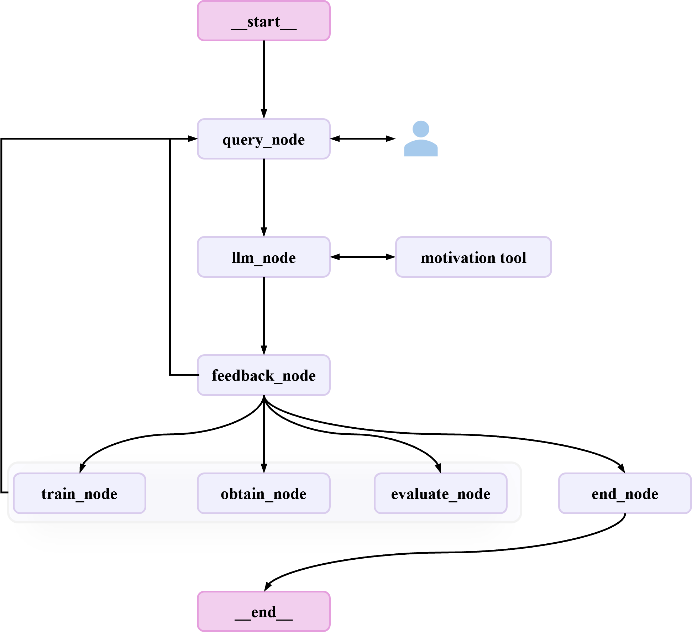

# Dataflow-LoopAI

Dataflow-LoopAI is an intelligent system with self-optimization capabilities that automatically detects and evaluates generation deficiencies in LLMs within specific domains. Through dialog-based active data retrieval and self-driven optimization mechanisms, it enables continuous co-evolution between data and models.

```markdown
User  ⇄  Manager（控制逻辑） ⇄  LangGraph（状态机）
                 │
                 ├── 普通问答：直接返回
                 └── 复杂任务：进入图（评估 → 挖掘 → 训练）
```

## 🧠 整体框架

<p align="center">
  
</p>

---

## 📂 项目结构说明

下面是经过整理与美化的项目目录结构，展示了主要模块的职责：

```
Dataflow-LoopAI/
├── examples/                  # 示例脚本与运行用例
│   └── scripts/               # 启动、测试等脚本
│
├── loopai/                    # 项目核心目录
│   ├── agents/                # 各类智能 Agent（每个 Agent 是一个子状态机）
│   │   ├── BaseAgent/         # 基础 Agent 定义
│   │   ├── Starter/           # 主入口 Agent
│   │   ├── Analyzer/          # 模型评估/挖掘 Agent
│   │   └── ...                # 其他自定义 Agent
│   │
│   ├── common/                # 全局工具
│   │   ├── prompts/           # 通用 Prompt 模板
│   │   └── ...                # 其它通用组件
│   │
│   ├── memory/                # 持久化存储（当前使用简单存储，未来可扩展数据库）
│   │
│   ├── states/                # 状态定义 & 事件定义
│   │
│   ├── utils/                 # 通用工具类与辅助代码
│   │
│   └── ...                    # 其它框架相关内容
│
└── docs/                      # 文档与资源
    └── assets/                # 图片与素材
```

🤖 已实现的核心 Agent

目前 Dataflow-LoopAI 已实现以下核心 Agent，每个 Agent 均作为一个 **可独立运行、可组合调度的子图（subgraph）**：

### ✅ `StarterAgent`

作为系统的 **总调度 supervisor**，负责：

* 与用户对话
* 解析任务意图
* 自动选择并调用其他 Agent
* 管理任务的整体执行流程

### ✅ `JudgerAgent`

用于自动评测待测试模型，主要功能包括：

* 自动生成代码（调用 LLM）
* 提交到 OJ（在线判题）系统执行
* 收集运行结果与评测数据

### ✅ `AnalyzerAgent`

基于 JudgerAgent 的评测结果，负责：

* 统计与分析模型表现
* 挖掘错误类别与模式
* 生成可读性强的分析报告

### ✅ `ConfigerAgent`

作为系统的交互式配置专家，负责：

* 与用户对话修改配置信息
* 缺失信息反馈和修改再校验(TODO)
* 继续执行中断节点(TODO)
---

## 📦 安装

```bash
pip install -e .
```


## ✅ 快速测试指南

### 1️⃣ 启动 vLLM 服务

```bash
conda activate vllm
bash examples/scripts/run_manager_vllm.sh
```

---

### 2️⃣ 运行测试示例（以 `run_judger.py` 为例）

修改脚本中的模型路径与配置：

```python
{
    'eval_model_path': '/home/lpc/models/glm-4-9b-chat/',
    'eval_base_url': 'http://127.0.0.1:8911/v1',
    'eval_api_key': api_key,
    'eval_test_case_path': '/home/lpc/repos/Dataflow-LoopAI/output/test.json',
    'eval_problem_path': '/home/lpc/repos/Dataflow-LoopAI/data/human-eval-v2-20210705.jsonl',
    'eval_result_path': '/home/lpc/repos/Dataflow-LoopAI/output/result.json',
}
```

运行：

```bash
python examples/scripts/run_judger.py
```

---

## 🛠️ 定义一个新 Agent

在 Dataflow-LoopAI 中，每个 **Agent 实质上是一个子图（subgraph）**，由多个节点函数与边逻辑构成，并会被自动整合到 `StarterAgent` 中进行协调调度。

### ✅ 继承 `BaseAgent`

所有自定义 Agent 需继承 `BaseAgent`，其提供：

* 基础事件记录机制（`agent_event`）
* 可选通用 LLM 对话节点构建方法：`create_llm_node`
* 标准的图初始化入口：`init_graph`
* 统一的调用协议：`__call__`

### ✅ 初始化图（状态机）

```python
def init_graph(self, **kwargs):
    builder = StateGraph(LoopAIState)
    ...
    self.graph = builder.compile(
        checkpointer=self.checkpointer,
        store=self.store,
        **kwargs
    )
```

### ✅ Agent 调用方式

* 子图模式：

```python
self.init_graph(**kwargs)
return self.graph
```

* StarterAgent 中的流式调用：

```python
for res in self.graph.stream(
        Command(resume=input),
        subgraphs=True,
        stream_mode=["updates", "messages"],
        **invoke_args
    ):
    yield res
```

### 📐 Agent 规范建议

为了保持项目可维护性与一致性，推荐遵循以下规范：

1. 命名规范

* Agent 类名：**大写开头驼峰**（如 `AnalyzerAgent`）
* 文件夹：**大写开头驼峰**
* Python 文件：**小写 + 下划线**（如 `eval_model.py`）

2. 代码组织结构

当节点逻辑较复杂时，推荐：

* ✅ 节点放入 `nodes/` 子文件夹：
  示例：`loopai/agents/Analyzer/nodes/eval_model.py`

* ✅ 工具函数放入 `utils/`：
  示例：`loopai/agents/Analyzer/utils/llmaj.py`

* ✅ LLM 工具调用放入 `tools/`：
  示例：`loopai/agents/Starter/tools/check_motivation.py`

* ✅ Agent 本体保持“薄”，节点逻辑不要堆积在类中，便于维护。

---

## 🧩 全局 Prompt 使用规范

为了保证整个系统中 Prompt 的统一性与可维护性，Dataflow-LoopAI 提供了 **全局 Prompt 模板管理机制**。所有通用 Prompt 均在 `common/prompts/` 中定义，并通过统一的加载器进行管理。

### ✅ Prompt 模板加载机制

默认全局 Prompt 模板文件位于：

```
loopai/common/prompts/
```

由以下工具类负责加载：

```
prompt_loader.py
```

在 `BaseAgent` 中统一初始化：

```python
self.prompt_loader = PromptLoader(prompt_template_dir)
```

你可以通过修改 `prompt_template_dir` 来指定不同的 Prompt 扫描路径，实现自定义扩展。

---

## 🧭 Agent 的系统 Prompt 定义

每个继承 `BaseAgent` 的自定义 Agent，需要通过以下两个抽象属性指定自身的系统 Prompt：

```python
@property
@abstractmethod
def system_prompt_type(self) -> str:
    """System prompt type"""
    return "system"

@property
@abstractmethod
def system_prompt_name(self) -> str:
    """System prompt name"""
    pass
```

### ✅ `system_prompt_type`

* 用于指定 Prompt 的角色类型，如：

  * `"system"`
  * `"user"`
  * `"assistant"`
* 其对应的文件存储格式为：

```
<prompt_type>_prompt.json
```

例如：

```
system_prompt.json
user_prompt.json
assistant_prompt.json
```

### ✅ `system_prompt_name`

* 用于指定具体要加载的 Prompt 名称，例如 `"default_prompt"`。
* 加载方式为在对应的 `<prompt_type>_prompt.json` 文件中查找同名字段：

```json
{
  "default_prompt": "..."
}
```

系统将自动从对应 JSON 中读取该模板，作为 Agent 的系统 Prompt 注入运行流程。

## 📡 状态监测机制

`BaseAgent` 内置 `AgentEvent`，用于完整追踪 Agent 的执行过程：

### 记录内容包括：

* `stream_mode`
* 当前执行节点 (`node`)
* 状态更新 (`state_updates`)
* 消息流 (`stream_message`)
* 执行路径 (`path`) 等

### 检测的事件类型：

* ✅ `update` —— 状态更新事件
* ✅ `message` —— LLM 及节点消息
* ✅ `custom` —— 用户自定义事件

这些事件使系统具备 **可观测性（observability）**，便于调试、可视化与日志分析。

## 自定义Stream事件

在子图中, 有些不必要存放在`LoopAIState`但仍需监测的参数信息可以通过触发自定义get_stream_writer来实现, 在LoopAI中我们通过`StreamEvent`来规范自定义事件的格式。这些字段将被记录在`AgentEvent`中, 并可以在可视化工具中展示。

### 字段说明

`StreamEvent`包含以下字段:

* `current`: 当前节点名称
* `progress`: 进度值（可选）
* `progress_num`: 进度数值（可选）
* `total`: 总进度（可选）
* `message`: 消息内容（可选）
* `data`: 自定义数据（可选）

### 示例

假设我们在`AnalyzerAgent`中监测`configer_error`字段, 当该字段发生变化时, 我们希望将其记录下来。

在`AnalyzerAgent`中, 我们可以在`eval_model`节点中添加如下代码:

```python
from langgraph.config import get_stream_writer
from loopai.schema.events import StreamEvent

writer = get_stream_writer()
writer(StreamEvent(current=state['current'], data={'configer_error': state['configer_error']}).json())
```
