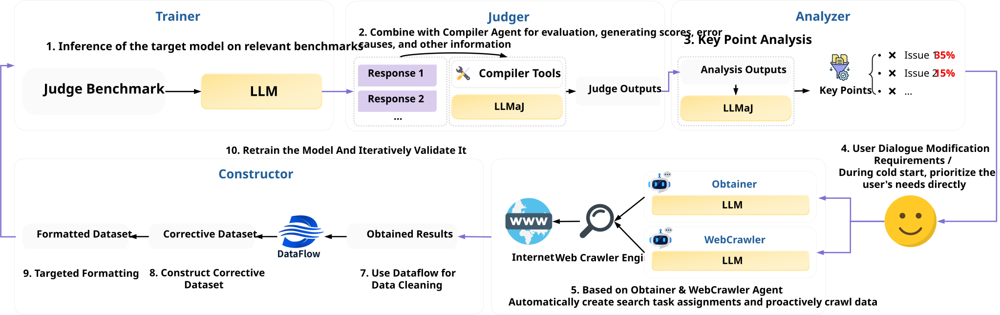

<div align="center">
  
  <h1>LoopAI: A Closed-loop Optimization Framework</h1>

  <p>
    <a href="https://www.python.org/">
      
    </a>
    <a href="./LICENSE">
      
    </a>
  </p>

  <h4><i>✨ An Intelligent System with Self-Evolving Capabilities ✨</i></h4>
</div>

<br>

English | [简体中文](./docs/README_zh.md)

LoopAI is an intelligent system designed for **self-evolving LLMs in domain-specific scenarios**. It automatically detects and evaluates generation deficiencies, and continuously improves model performance through **dialog-driven data acquisition and closed-loop optimization**.

```text
User  ⇄  Starter (Codex SDK)  ⇄  Node (Skill)
                  │
                  ├── Common Question → Direct Response
                  └── Complex Task → Closed-loop Execution
                                 (Evaluation → Data Collection → Training)
```

<p align="center">
  
</p>

---

## 📰 1. News

* **[2026-05] 🎉 LoopAI (v0.1.0) is officially open-sourced!**
  We are excited to release the first version of LoopAI, enabling full automation from **natural language instructions to model optimization**.
  Say goodbye to tedious manual pipelines—LLM evaluation and optimization are now as simple as chatting.
  ⭐ Feel free to star the project and follow future updates!

---

## 💡 2. Why LoopAI?

Traditional LLM optimization workflows require users to manually:

* Evaluate model outputs
* Analyze failure cases
* Collect and curate training data

**LoopAI redefines this paradigm**:

> 🚀 *Everything that can be automated is handled by the system runtime.*

From evaluation to retraining, LoopAI provides a **seamless, interactive, and fully automated optimization experience**.

---

## 🔍 3. Overview

LoopAI reformulates the LLM optimization pipeline into a **node-based execution framework (Graph / Node / State)**, enabling a new generation of interactive optimization systems:

* 🗣️ **NL2Optimize**
  Simply describe your goal in natural language (e.g., *“Improve my model's code generation ability”*), and LoopAI will automatically plan the optimization workflow.

* 🔄 **End-to-End Automation**
  Covers the full pipeline: evaluation → error analysis → data acquisition → retraining.

* 👨‍💻 **Human-in-the-Loop**
  Supports manual intervention at critical steps (e.g., reviewing evaluation results, selecting data), allowing flexible strategy adjustment.

* 📊 **Scalable Architecture**
  Uses composable nodes, persistent task state, and Codex-driven orchestration to integrate private datasets, evaluation services, and training workflows.

* 🧭 **Codex-powered Starter**
  The starter is implemented around `codex-sdk`, acting as the interactive entry point that interprets user intent and dispatches the right nodes or skills.

---

## 🚀 4. Quick Start

### 4.1 Installation

```bash
conda create -n loopai python=3.12
conda activate loopai

pip install uv
uv pip install -e .
```

To use the starter built on `codex-sdk`, first install Codex itself; if it is already installed on your machine, you can skip that step.

Choose the official Codex installation method that fits your environment:

```bash
# Official install script for macOS / Linux
curl -fsSL https://chatgpt.com/codex/install.sh | sh

# Or install globally with npm
npm install -g @openai/codex
```

On macOS, you can also install it with Homebrew:

```bash
brew install --cask codex
```

On Windows, the official install script is:

```powershell
powershell -ExecutionPolicy ByPass -c "irm https://chatgpt.com/codex/install.ps1 | iex"
```

After installation, it is a good idea to verify it first:

```bash
which codex
codex --version
```

Then run it once:

```bash
codex
```

On first launch, follow the prompt to sign in. The official docs currently describe two common options:

* Sign in with your ChatGPT account
* Sign in with an OpenAI API key

Once `codex` is working, install the `codex-runner` dependencies:

```bash
cd codex-runner
yarn
```

You can also do a quick `codex-runner` build check:

```bash
cd codex-runner
yarn build
```

---

### 4.2 Configure LoopAI

All run modes require a root-level `starter.yaml`.

1. Copy the starter configuration to the repository root:

```bash
cp examples/config/starter.yaml ./starter.yaml
```

2. Edit `starter.yaml`. A minimal configuration that is usually enough to boot the backend is:

```yaml
system:
  api_port: 8855
  tavily_api_key: ""

model:
  proxy_base_url: "http://127.0.0.1:{same as api_port}/responseProxy/v1"
  proxy_api_key: "loopai-local-proxy"
  default_model: "default"
  codex_model: "default"
  looper_model: "default"
  default_tier: "medium"
  pool:
    - tier: "medium"
      name: "default"
      api_key: "xxx"
      base_url: "https://api.deepseek.com"
      model_name: "deepseek-v4-flash"
      maxworker: 1
      wire_api: "chat"
      response_format: ""
      enabled: true
```

After the service starts, most other settings can be completed or adjusted from the WebUI Configer flow. In practice, the most important bootstrap items are the API port and a working default model-pool entry.

Configuration notes:

* `proxy_base_url` is useful when you need to convert an OpenAI-compatible Chat Completions endpoint into a Responses-style endpoint for models such as `deepseek-v4-flash`.
* `default_model` points to the `name` field of an entry in `model.pool`, and is usually the default API model used by nodes.
* `codex_model` is the model used by the starter.

For where to obtain `tavily_api_key` and other optional third-party credentials, see [docs/API_KEYS.md](./docs/API_KEYS.md). Do not commit real credentials to the repository.

---

### 4.3 Start Services

LoopAI supports two modes:

#### ✅ Option A: WebUI API Mode (Recommended)

1. Install the published frontend dist.

For production or normal WebUI use, install the published frontend dist first. The backend serves `api/dist` directly, so you do not need to build or run the frontend dev server.

```bash
python scripts/download_ui_release.py
```

If the release asset cannot be downloaded automatically, download the frontend dist archive from the GitHub Release page manually, then extract it into `api/dist`.

2. Start the backend:

```bash
python api/start.py
```

The WebUI and API will be available at:

```text
http://localhost:8855
```

API docs are available at:

```text
http://localhost:8855/docs
```

---

<p align="center">
  
</p>

Frontend source setup, Vite proxy configuration, and UI release publishing are covered in [docs/Dev_README.md](./docs/Dev_README.md).

---

#### ✅ Option B: Terminal Mode

The terminal UI is intended for machines where a browser is unavailable or inconvenient. It currently supports task management and launching node execution from the main conversation view, but does not yet cover data-lake operations, manual configuration editing, or the more complex state-inspection flows available in the WebUI.

Build the terminal UI once, then start it with:

```bash
cd tui
yarn build
yarn start
```

If you already built it before, starting it is simply:

```bash
cd tui
yarn start
```

By default, the TUI connects to:

```text
http://127.0.0.1:8855
```

---

### 4.4 Optional Runtime Dependencies

`pip install -e .` installs the core LoopAI package, API service, orchestration runtime, and common data-processing dependencies. Some nodes and skills call heavy ML runtimes that are easier to keep in separate Conda environments because their CUDA, PyTorch, and serving requirements may conflict.

Recommended layout:

```bash
# Core LoopAI runtime
conda create -n loopai python=3.12

# Local OpenAI-compatible inference for Judger / Analyzer
conda create -n loopai-vllm python=3.10

# Local training with LlamaFactory
conda create -n loopai-llamafactory python=3.10

# Local training with verl
conda create -n loopai-verl python=3.10
```

Install `vllm`, `LLaMA-Factory`, and `verl` according to their upstream instructions and your CUDA/PyTorch version. They are not pinned in LoopAI because GPU environments are usually machine-specific.

Skill-specific notes:

* **Judger Skill**: for local model evaluation, install `vllm` in a separate environment and set `judger.eval_vllm_env_path` to the Python executable, for example `/path/to/miniconda3/envs/loopai-vllm/bin/python`. When `judger.eval_base_url` is empty, Judger uses this interpreter to start a local vLLM OpenAI-compatible API server in a subprocess, with parameters such as `eval_vllm_port`, `eval_vllm_tensor_parallel_size`, `eval_vllm_gpu_memory_utilization`, and `eval_env_configs`. If you already run a compatible service yourself, set `judger.eval_base_url` and Judger will use that service instead.
* **Analyzer Skill**: Analyzer calls an OpenAI-compatible chat endpoint through `analyzer.analyze_base_url`, `analyzer.analyze_model_path`, and `analyzer.analyze_api_key`. For local analysis, you can serve the analysis model with vLLM in the same vLLM environment and point `analyze_base_url` to it. Analyzer does not currently start vLLM by itself.
* **Obtainer Skill**: the legacy `ObtainerAgent` is retired. Dataset search, download, lake ingest, and SFT export should use `skills/obtainer/SKILL.md`, `docs/OBTAINERCLI_USAGE.md`, and `python -m loopai.skills.ObtainerCLI.cli`. New dataset-acquisition workers resolve model endpoints from the warehouse model pool, `CODEX_*`/`DEEPSEEK_*` environment variables, or the starter system config.
* **Constructor Skill**: post-processing, cleaning, and format mapping use the core LoopAI environment installed by `pip install -e .`. Constructor calls an OpenAI-compatible chat endpoint through `constructor.model_path`, `constructor.base_url`, and `constructor.api_key`; if these are empty, several paths fall back to the Analyzer model settings. Benchmark-aware cleaning can additionally use `constructor.benchmark_source_dir` or benchmark pool fields, and the postprocess v2 path may use `TAVILY_API_KEY` for source reference search.
* **WebCrawler Skill**: web crawling remains available as an extensible runtime node and can be combined with Obtainer and Constructor flows for data acquisition pipelines.
* **Trainer Skill**: local training normally requires `LLaMA-Factory` or `verl`. Set `trainer.train_framework` to `llamafactory` or `verl`. For LlamaFactory, set `trainer.llamafactory_dir` to the LLaMA-Factory repository and `trainer.llamafactory_env_path` to the environment root or `bin` directory, for example `/path/to/miniconda3/envs/loopai-llamafactory/bin`. For verl, provide `verl_dir` and `verl_env_path` in the trainer or system config. Trainer launches the selected framework as a managed subprocess, streams logs back to LoopAI, and keeps the Skill call in the foreground until training completes, fails, or is cancelled.

These fields can be provided through the WebUI Configer flow, in node state, or in `starter.yaml` under the corresponding `judger`, `analyzer`, `obtainer`, `constructor`, `trainer`, or `system` sections.

---

## 🧠 5. Core Nodes

LoopAI organizes its main runtime around **independent and composable nodes**, with the starter coordinating execution and the skills providing reusable capability surfaces.

### 🤖 Starter

* Handles user interaction and intent parsing
* Uses `codex-sdk` to coordinate downstream skills and nodes
* Manages the overall execution workflow

### 🔁 Looper Node

* Acts as the continuity layer between the user conversation and the starter
* Automatically maintains the chat flow, summarizes recent conversation context, and fills in follow-up parameters when possible
* Talks to the starter on the user's behalf so the loop can continue without manual turn-by-turn intervention
* Helps keep long-running closed-loop workflows from being interrupted when the next step is already implied by the conversation

### 🤖 Judger Node

* Automatically generates evaluation cases (LLM-based)
* Integrates external evaluation systems
* Collects structured results and logs

### 🤖 Analyzer Node

* Performs statistical analysis on evaluation results
* Identifies failure patterns and error types
* Generates interpretable diagnostic reports

### 🤖 Obtainer, Constructor, and WebCrawler Nodes

* Discovers and downloads domain-specific datasets
* Ingests datasets into the DataMixer warehouse with dataset cards and lineage
* Exports training-ready data through DataMixer recipes
* Supports cleaning, mapping, and extensible web data crawling

### 🛠️ Trainer Node

* Performs incremental training with new data
* Supports continual learning to prevent forgetting
* Enables closed-loop model improvement

---

## 🚀 6. Future Work

We will continue improving LoopAI in the following directions:

* 💻 **Broader Domain Support**
* 🧪 **Training Strategy and Data Selection Optimization**
* 🛡️ **Stronger Starter Boundary Capabilities and Safety Constraints**
* 📏 **Vertical-domain Evaluation Optimization**
* 🧩 **Plugin-based Nodes**

---

## 🙌 7. Contributing

We warmly welcome contributions!

* 📮 Submit issues via GitHub Issues
* 🔧 Contribute via Pull Requests

---

## 📄 8. License

This project is licensed under the **Apache 2.0 License**.
See the [LICENSE](./LICENSE) file for details.
