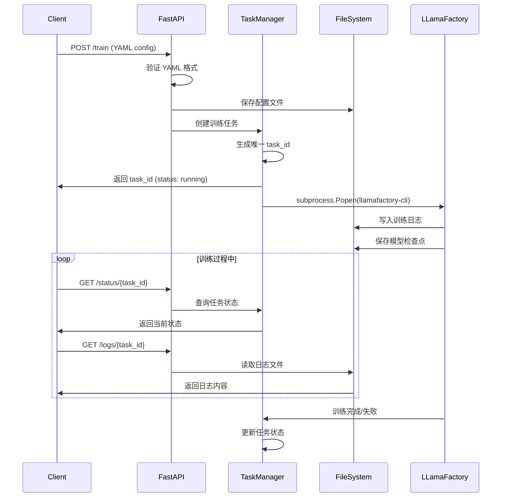

# 🚀 LLaMA Factory Remote Training Service

## 📖 项目概述

LLaMA Factory Remote Training Service 是一个基于 FastAPI 的远程训练服务，旨在将原本需要在本地执行的 LLaMA Factory 训练任务转换为可远程调用的 API 服务。通过这个服务，客户端无需安装复杂的训练环境，只需要通过简单的 HTTP 请求即可触发模型训练任务。

### 🎯 核心目标

将原本的本地命令：
```bash
llamafactory-cli train examples/train_lora/llama3_lora_sft.yaml
```

转换为远程 API 调用：
```bash
curl -X POST http://server:8000/train -d '{"config": "..."}'
```

## ✨ 功能特性

- ✅ **REST API 接口** - 完整的 RESTful API 设计
- ✅ **多种配置上传方式** - 支持 JSON 和文件上传两种方式
- ✅ **异步训练执行** - 后台异步执行，不阻塞 API 请求
- ✅ **实时状态查询** - 查询训练任务的实时状态
- ✅ **日志管理** - 实时获取训练日志
- ✅ **任务管理** - 创建、查询、取消训练任务
- ✅ **健康检查** - 服务健康状态监控
- ✅ **错误处理** - 完善的异常处理机制
- ✅ **资源清理** - 自动清理已完成的任务

## 🏗️ 架构设计

### 整体架构

```
┌─────────────────┐    HTTP API     ┌─────────────────┐
│   Client App    │ ───────────────▶ │   FastAPI App   │
│                 │                 │                 │
│ - Trainer Agent │                 │ - API Endpoints │
│ - Web UI        │                 │ - Task Manager  │
│ - CLI Tools     │                 │ - File Handler  │
└─────────────────┘                 └─────────────────┘
                                              │
                                              ▼
                                    ┌─────────────────┐
                                    │ Background Exec │
                                    │                 │
                                    │ subprocess.Popen│
                                    │ llamafactory-cli│
                                    └─────────────────┘
                                              │
                                              ▼
                                    ┌─────────────────┐
                                    │   File System   │
                                    │                 │
                                    │ - configs/      │
                                    │ - logs/         │
                                    │ - runs/         │
                                    └─────────────────┘
```

### 核心组件

#### 1. FastAPI Application (`app/main.py`)
- **职责**: HTTP 请求处理、路由管理、响应格式化
- **主要端点**:
  - `POST /train` - 启动训练任务
  - `GET /status/{task_id}` - 查询任务状态
  - `GET /logs/{task_id}` - 获取任务日志
  - `GET /tasks` - 获取所有任务
  - `DELETE /tasks/{task_id}` - 取消任务

#### 2. Task Manager (`app/tasks.py`)
- **职责**: 训练任务的生命周期管理
- **核心功能**:
  - 任务创建和状态跟踪
  - 后台进程执行和监控
  - 任务取消和资源清理
  - 线程池管理

#### 3. Data Models (`app/models.py`)
- **职责**: API 数据结构定义
- **主要模型**:
  - `TrainRequest` - 训练请求数据
  - `TaskStatusResponse` - 任务状态响应
  - `LogResponse` - 日志响应数据

#### 4. Utilities (`app/utils.py`)
- **职责**: 通用工具函数
- **主要功能**:
  - 文件操作（保存配置、读取日志）
  - YAML 格式验证
  - 时间戳生成
  - 目录管理

## 🚀 快速开始

### 环境要求

#### 服务端必须安装：
```bash
# Python 环境
Python 3.8+

# 深度学习环境（可选，用于 GPU 训练）
CUDA 11.8+ / ROCm（AMD GPU）

# Python 包依赖
pip install -r requirements.txt

# LLaMA Factory（核心训练框架）
pip install llamafactory-cli
```

#### 客户端要求：
- 无特殊要求，只需要能发送 HTTP 请求的工具或库

### 安装步骤

1. **配置 LLaMA Factory**

从`examples/config`拷贝`starter.yaml`至项目根目录并指定`llamafactory_dir`和`llamafactory_env_path`

```yaml
llamafactory_dir: "/home/lpc/repos/LLaMA-Factory/"
llamafactory_env_path: "/home/lpc/miniconda3/envs/lmf/bin/"
```

1. **启动服务**
```bash
python cpi/start.py
```
或者：
```bash
uvicorn api.app.main:app --host 0.0.0.0 --port 8000
```

1. **验证服务**
```bash
# 健康检查
curl http://localhost:8000/health

# API 文档
打开浏览器访问: http://localhost:8000/docs
```

## 📚 API 文档

### 1. 启动训练任务

#### POST /train - JSON 配置方式
```bash
curl -X POST "http://localhost:8000/train" \
  -H "Content-Type: application/json" \
  -d '{
    "config": "model_name: llama3\nstage: sft\ndo_train: true\nfinetuning_type: lora\ndataset: alpaca_gpt4_en",
    "task_name": "我的训练任务"
  }'
```

**响应示例:**
```json
{
  "task_id": "a1b2c3d4-e5f6-7890-abcd-ef1234567890",
  "status": "running",
  "message": "Training task started successfully"
}
```

#### POST /train/upload - 文件上传方式
```bash
curl -X POST "http://localhost:8000/train/upload" \
  -F "file=@config.yaml" \
  -F "task_name=我的训练任务"
```

### 2. 查询任务状态

#### GET /status/{task_id}
```bash
curl "http://localhost:8000/status/a1b2c3d4-e5f6-7890-abcd-ef1234567890"
```

**响应示例:**
```json
{
  "task_id": "a1b2c3d4-e5f6-7890-abcd-ef1234567890",
  "status": "running",
  "created_at": "2025-11-30T10:30:00.123456",
  "started_at": "2025-11-30T10:30:02.456789",
  "completed_at": null,
  "error_message": null
}
```

**状态说明:**
- `pending` - 任务已创建，等待执行
- `running` - 任务正在执行
- `completed` - 任务成功完成
- `failed` - 任务执行失败
- `cancelled` - 任务被取消

### 3. 获取训练日志

#### GET /logs/{task_id}
```bash
# 获取全部日志
curl "http://localhost:8000/logs/a1b2c3d4-e5f6-7890-abcd-ef1234567890"

# 获取最近100行日志
curl "http://localhost:8000/logs/a1b2c3d4-e5f6-7890-abcd-ef1234567890?max_lines=100"
```

**响应示例:**
```json
{
  "task_id": "a1b2c3d4-e5f6-7890-abcd-ef1234567890",
  "logs": "2025-11-30 10:30:15,123 - INFO - Starting training...\n2025-11-30 10:30:16,456 - INFO - Loading model...",
  "total_lines": 1245
}
```

### 4. 任务管理

#### GET /tasks - 获取所有任务
```bash
curl "http://localhost:8000/tasks"
```

#### DELETE /tasks/{task_id} - 取消任务
```bash
curl -X DELETE "http://localhost:8000/tasks/a1b2c3d4-e5f6-7890-abcd-ef1234567890"
```

### 5. 健康检查

#### GET /health
```bash
curl "http://localhost:8000/health"
```

## 🔧 配置文件格式

服务支持标准的 LLaMA Factory YAML 配置格式：

```yaml
# 模型配置
model_name: llama3
model_name_or_path: /path/to/llama3-8b-hf

# 数据集配置
dataset: alpaca_gpt4_en
template: llama3

# 训练参数
stage: sft
do_train: true
finetuning_type: lora
lora_target: q_proj,v_proj
lora_rank: 8
lora_alpha: 16
lora_dropout: 0.1

# 数据集参数
dataset_dir: data
cutoff_len: 1024
max_samples: 1000
overwrite_cache: true
preprocessing_num_workers: 8

# 输出配置
output_dir: saves/llama3/lora/sft
logging_steps: 10
save_steps: 500
plot_loss: true
overwrite_output_dir: true

# 训练超参数
per_device_train_batch_size: 1
gradient_accumulation_steps: 8
learning_rate: 5.0e-5
lr_scheduler_type: cosine
warmup_steps: 100
num_train_epochs: 3.0
max_grad_norm: 1.0
bf16: true

# 评估配置
evaluation_strategy: steps
eval_steps: 500
per_device_eval_batch_size: 1
load_best_model_at_end: true
metric_for_best_model: eval_loss
```

## 💡 实现逻辑详解

### 任务执行流程



### 核心设计原理

#### 1. 异步执行机制
- 使用 `ThreadPoolExecutor` 管理训练任务
- `subprocess.Popen` 启动独立的训练进程
- 非阻塞式 API 响应，支持并发请求

#### 2. 任务状态管理
```python
# 任务状态流转
PENDING → RUNNING → (COMPLETED | FAILED | CANCELLED)

# 状态存储结构
task_info = {
    'task_id': str,
    'status': TaskStatus,
    'created_at': datetime,
    'started_at': datetime,
    'completed_at': datetime,
    'process': subprocess.Popen,
    'error_message': str
}
```

#### 3. 文件系统组织
```
api/
├── configs/           # 训练配置文件
│   └── {task_id}.yaml
└── logs/             # 训练日志
    └── {task_id}.log
```
