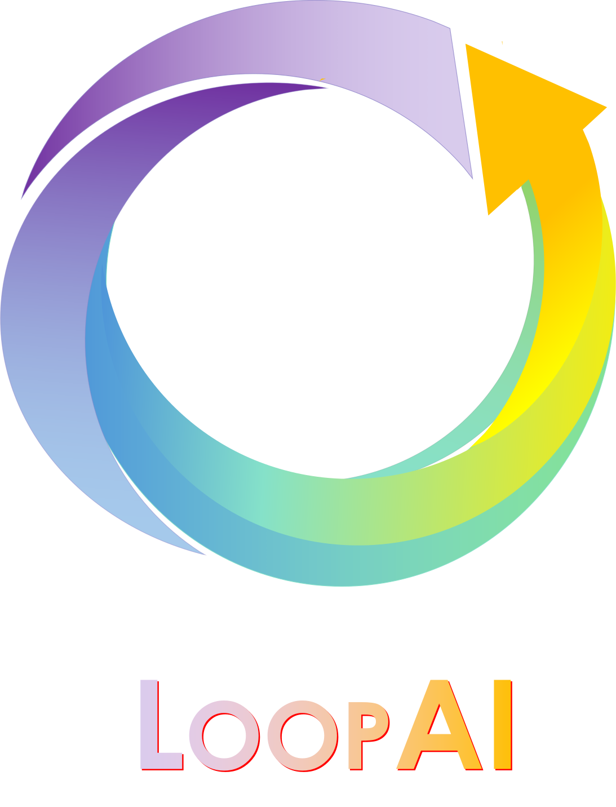
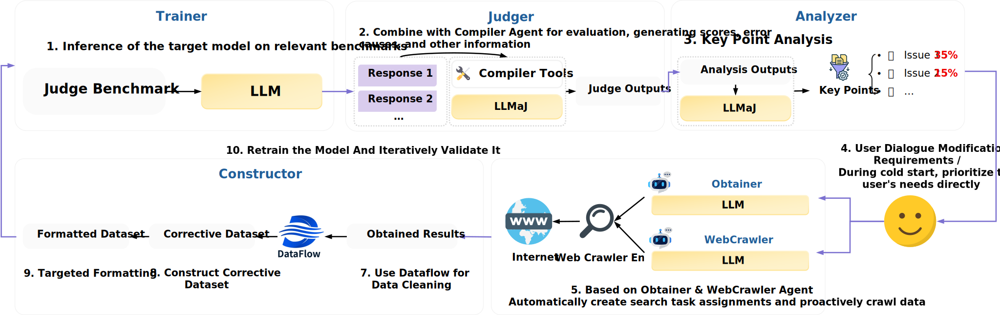
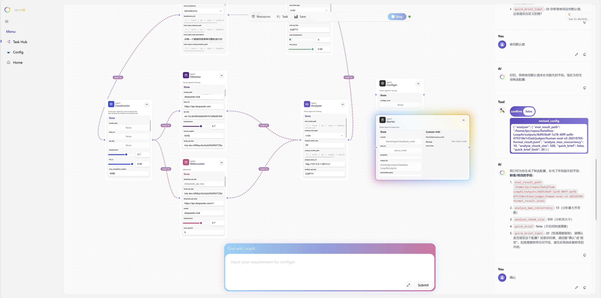

<div align="center">
  
  <h1>LoopAI：LLM自主闭环优化框架</h1>

  <p>
    <a href="https://www.python.org/">
      
    </a>
    <a href="../LICENSE">
      
    </a>
  </p>

  <h4><i>✨ 具备自优化能力的智能系统 ✨</i></h4>
</div>

<br>

简体中文 | [English](/README.md)

LoopAI 是一个面向**特定领域大语言模型（LLMs）自优化**的智能系统。它能够自动检测并评估模型生成中的缺陷，并通过**对话驱动的数据获取与闭环优化机制**，持续提升模型性能。

```text
User  ⇄  Starter（调度器）  ⇄  Sub-Agent
                  │
                  ├── 简单问题 → 直接返回
                  └── 复杂任务 → 图执行流程
                                 （评测 → 数据收集 → 训练）
```

<p align="center">
  
</p>

---

## 📰 1. 最新动态

* **[2026-03] 🎉 LoopAI（v0.1.0）正式开源！**
  我们发布了 LoopAI 的首个版本，实现了从**自然语言指令到模型优化的全流程自动化**。
  告别繁琐的人工流程，让 LLM 的评测与优化像对话一样简单直观。
  ⭐ 欢迎 Star 支持并关注后续更新！

---

## 💡 2. 为什么选择 LoopAI？

传统的大语言模型优化流程通常需要用户手动完成：

* 模型效果评测
* 错误分析
* 数据收集与构建

**LoopAI 对这一范式进行了重构**：

> 🚀 *一切可以自动化的工作，全部交给 Agent 完成。*

从评测到再训练，LoopAI 提供了一个**无缝衔接、交互友好、全流程自动化**的优化体验。

---

## 🔍 3. 系统概览

LoopAI 将 LLM 的优化流程重构为一个**基于图的执行框架（Graph / Node / State）**，致力于构建新一代交互式优化系统：

* 🗣️ **NL2Optimize**
  只需用自然语言描述你的目标（例如：“提升模型的代码生成能力”），系统即可自动解析意图并规划优化流程。

* 🔄 **端到端自动化**
  覆盖完整流程：评测 → 错误分析 → 数据获取 → 模型训练。

* 👨‍💻 **Human-in-the-Loop（人类参与）**
  支持在关键步骤（如评测结果审核、数据筛选）进行人工干预，实现灵活的优化策略调整。

* 📊 **可扩展架构**
  基于 LangGraph 状态管理机制，支持轻松接入私有数据集与自定义评测指标。

---

## 🚀 4. 快速开始

### 4.1 安装

```bash
conda create -n loopai python=3.12
conda activate loopai

pip install -e .
```

---

### 4.2 配置 LoopAI

所有运行模式都需要在项目根目录准备 `starter.yaml`。

1. 将 starter 配置复制到项目根目录：

```bash
cp examples/config/starter.yaml ./starter.yaml
```

2. 编辑 `starter.yaml`，并至少自行填写以下 `system` 字段：

```yaml
system:
  starter_api_key: ""
  starter_model_path: ""
  starter_model_name: ""
  starter_base_url: ""
  tavily_api_key: ""
  kaggle_username: ""
  kaggle_key: ""
```

这些字段用于配置 Starter 模型服务，以及 LoopAI 使用的外部数据搜索凭据。

---

### 4.3 启动服务

LoopAI 支持两种运行模式：

#### ✅ 方式一：WebUI API 模式（推荐）

生产环境或常规 WebUI 使用场景下，先安装已发布的前端 dist。后端会直接托管 `api/dist`，因此不需要构建或运行前端开发服务器。

```bash
python scripts/download_ui_release.py
```

如果脚本无法自动下载 release 产物，可以手动从 GitHub Release 页面下载前端 dist 压缩包，并解压到 `api/dist`。

然后启动后端：

```bash
python api/start.py
```

WebUI 和 API 服务地址：

```
http://localhost:8855
```

API 文档地址：

```
http://localhost:8855/docs
```

---

<p align="center">
  
</p>

前端源码开发、Vite 代理配置和 UI 发布流程请见 [开发文档](./Dev_README.md)。

---

#### ✅ 方式二：命令行模式

启动 LoopAI：

```bash
python examples/scripts/run_starter.py
```

---

### 4.4 可选运行时依赖

`pip install -e .` 会安装 LoopAI 主框架、API 服务、图编排和常用数据处理依赖。部分 Agent 会调用较重的机器学习运行时，这些依赖通常和 CUDA、PyTorch、推理/训练框架版本强相关，建议拆到独立 Conda 环境中维护。

推荐环境划分：

```bash
# LoopAI 主运行环境
conda create -n loopai python=3.12

# Judger / Analyzer 本地推理服务环境
conda create -n loopai-vllm python=3.10

# LlamaFactory 训练环境
conda create -n loopai-llamafactory python=3.10

# verl 训练环境
conda create -n loopai-verl python=3.10
```

请根据本机 CUDA/PyTorch 版本，分别按照 `vllm`、`LLaMA-Factory`、`verl` 的官方安装方式安装依赖。LoopAI 不在主依赖里固定这些包的版本，因为 GPU 环境通常需要按机器单独适配。

各 Agent 依赖说明：

* **JudgerAgent**：如果需要本地评测模型，通常需要在独立环境中安装 `vllm`，并将 `judger.eval_vllm_env_path` 配置为该环境的 Python 可执行文件，例如 `/path/to/miniconda3/envs/loopai-vllm/bin/python`。当 `judger.eval_base_url` 为空时，Judger 会使用这个解释器在子进程中启动本地 vLLM OpenAI 兼容服务，并读取 `eval_vllm_port`、`eval_vllm_tensor_parallel_size`、`eval_vllm_gpu_memory_utilization`、`eval_env_configs` 等参数。如果你已经手动启动了兼容服务，则填写 `judger.eval_base_url` 即可。
* **AnalyzerAgent**：Analyzer 通过 `analyzer.analyze_base_url`、`analyzer.analyze_model_path`、`analyzer.analyze_api_key` 调用 OpenAI 兼容聊天接口。本地分析时，可以复用 vLLM 环境启动分析模型，并将 `analyze_base_url` 指向该服务。当前 Analyzer 不会自动拉起 vLLM。
* **TrainerAgent**：本地训练通常需要 `LLaMA-Factory` 或 `verl`。将 `trainer.train_framework` 设置为 `llamafactory` 或 `verl`。使用 LlamaFactory 时，需要配置 `trainer.llamafactory_dir` 为 LLaMA-Factory 仓库路径，并配置 `trainer.llamafactory_env_path` 为环境根目录或 `bin` 目录，例如 `/path/to/miniconda3/envs/loopai-llamafactory/bin`。使用 verl 时，可在 trainer 或 system 配置中提供 `verl_dir` 和 `verl_env_path`。Trainer 会通过内部任务管理器异步启动训练，在子线程中拉起对应训练框架的子进程，并持续回传日志。

这些字段可以通过 WebUI 的 Configer 流程、Agent state，或 `starter.yaml` 中对应的 `judger`、`analyzer`、`trainer`、`system` 配置段提供。

---

## 🧠 5. 核心 Agents

LoopAI 中的每个 Agent 都被实现为一个**可独立运行、可组合的子图模块**。

### 🤖 StarterAgent（调度器）

* 负责用户交互与任务意图解析
* 动态编排下游 Agent
* 管理整体任务执行流程

### 🤖 JudgerAgent（评测代理）

* 自动生成评测用例（基于 LLM）
* 对接外部评测系统执行测试
* 收集结构化评测结果与日志

### 🤖 AnalyzerAgent（分析代理）

* 对评测结果进行统计分析
* 自动挖掘错误模式与失败类型
* 输出高可读性的诊断报告

### 🤖 ObtainerAgent & WebCrawlerAgent（数据获取代理）

* 推导数据获取策略
* 检索数据集与知识来源
* 清洗并结构化为训练数据
* 支持可扩展的 Web 数据抓取

### 🤖 TrainerAgent（训练代理）

* 基于新数据执行增量训练
* 支持持续学习以避免遗忘
* 实现模型能力的闭环提升

### 🤖 ConfigerAgent（配置代理）

* 与用户进行配置交互
* 支持动态参数调整
* 处理缺失信息与流程恢复

---

## 🚀 6. 未来工作

我们将持续在以下方向推进 LoopAI：

* 💻 **扩展更多应用领域**
* 🤖 **增强 Agent 智能与自主性**
* 🌐 **构建在线平台与社区**
* 📊 **提升可视化能力**

---

## 🙌 7. 贡献指南

欢迎参与共建！

* 📮 通过 GitHub Issues 提交问题或建议
* 🔧 通过 Pull Requests 贡献代码

---

## 📄 8. 开源协议

本项目基于 **Apache 2.0 License** 开源。
详情请参见 [LICENSE](../LICENSE) 文件。
