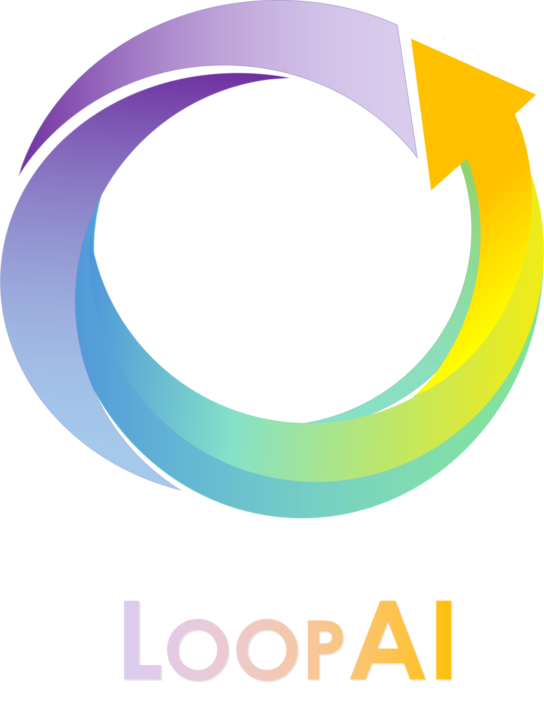
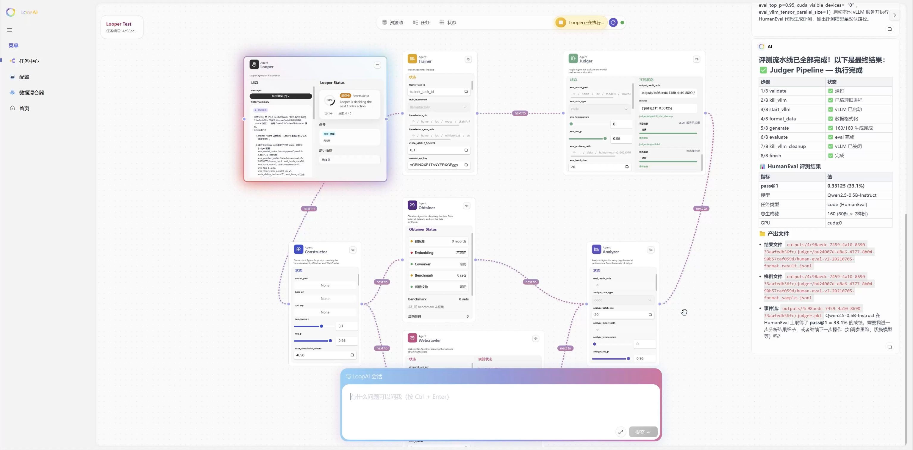

<div align="center">
  
  <h1>LoopAI：面向 LLM 自演化的闭环框架</h1>

  <p>
    <a href="https://www.python.org/">
      
    </a>
    <a href="../LICENSE">
      
    </a>
  </p>

  <h4><i>✨ 具备自演化能力的智能系统 ✨</i></h4>
</div>

<br>

简体中文 | [English](/README.md)

LoopAI 是一个面向**特定领域大语言模型（LLMs）自演化**的智能系统。它能够自动检测并评估模型生成中的缺陷，并通过**对话驱动的数据获取与闭环优化机制**，持续提升模型性能。

```text
User  ⇄  Starter（Codex SDK）  ⇄  Node （Skill）
                  │
                  ├── 简单问题 → 直接返回
                  └── 复杂任务 → 闭环执行流程
                                 （评测 → 数据收集 → 训练）
```

---

## 📰 1. 最新动态

* **[2026-08] 🚀 LoopAI-v2 现已发布！**
  LoopAI-v2 引入了基于 `codex-sdk` 的 Starter，将对话式意图转化为可执行的模型优化任务。
  它能够直接回答简单请求，编排由可复用节点和技能组成的复杂任务，并支持会话连续性、流式反馈和可配置的模型池接入。
  从评测、分析到数据获取和训练，都可以通过这个更具扩展性的交互入口构建和运行闭环工作流。

* **[2026-05] 🎉 LoopAI（v0.1.0）正式开源！**
  我们发布了 LoopAI 的首个版本，实现了从**自然语言指令到模型优化的全流程自动化**。
  告别繁琐的人工流程，让 LLM 的评测与优化像对话一样简单直观。
  ⭐ 欢迎 Star 支持并关注后续更新！

---

## 💡 2. 为什么选择 LoopAI？

传统的大语言模型优化流程通常需要用户手动完成：

* 模型效果评测
* 错误分析
* 数据收集与构建

**LoopAI 对这一范式进行了重构**：

> 🚀 *一切可以自动化的工作，全部交给系统运行时处理。*

从评测到再训练，LoopAI 提供了一个**无缝衔接、交互友好、全流程自动化**的优化体验。

---

## 🔍 3. 系统概览

LoopAI 将 LLM 的优化流程重构为一个**基于节点的执行框架（Graph / Node / State）**，致力于构建新一代交互式优化系统：

* 🗣️ **NL2Optimize**
  只需用自然语言描述你的目标（例如：“提升模型的代码生成能力”），系统即可自动解析意图并规划优化流程。

* 🔄 **端到端自动化**
  覆盖完整流程：评测 → 错误分析 → 数据获取 → 模型训练。

* 👨‍💻 **Human-in-the-Loop（人类参与）**
  支持在关键步骤（如评测结果审核、数据筛选）进行人工干预，实现灵活的优化策略调整。

* 📊 **可扩展架构**
  通过可组合节点、持久化任务状态和 Codex 驱动的编排机制，接入私有数据集、评测服务和训练流程。

* 🧭 **Codex 驱动的 Starter**
  Starter 基于 `codex-sdk` 实现，作为交互入口负责理解用户意图，并分发到合适的节点或技能。

---

## 🚀 4. 快速开始

### 4.1 安装

```bash
conda create -n loopai python=3.12
conda activate loopai

pip install uv
uv pip install -e .
```

要使用基于 `codex-sdk` 的 starter，还需要先安装 Codex 本体；如果你的机器上已经装好了，可以直接跳过这一步。

Codex 本体的官方安装方式可以按你的环境选择：

```bash
# macOS / Linux 官方安装脚本
curl -fsSL https://chatgpt.com/codex/install.sh | sh

# 或者继续使用 npm 全局安装
npm install -g @openai/codex
```

如果你在 macOS 上，也可以使用 Homebrew：

```bash
brew install --cask codex
```

如果你在 Windows 上，官方安装脚本是：

```powershell
powershell -ExecutionPolicy ByPass -c "irm https://chatgpt.com/codex/install.ps1 | iex"
```

安装完成后，建议先做一次检查：

```bash
which codex
codex --version
```

首次运行时直接执行：

```bash
codex
```

然后按提示登录。官方当前支持两种常见方式：

* 使用 ChatGPT 账户登录
* 使用 OpenAI API Key 登录

确认 `codex` 可用后，再安装 `codex-runner` 依赖：

```bash
cd codex-runner
yarn
```

你也可以顺手做一次 `codex-runner` 的构建检查：

```bash
cd codex-runner
yarn build
```

---

### 4.2 配置 LoopAI

所有运行模式都需要在项目根目录准备 `starter.yaml`。

1. 将 starter 配置复制到项目根目录：

```bash
cp examples/config/starter.yaml ./starter.yaml
```

2. 编辑 `starter.yaml`。通常下面这份最小配置就足以把后端启动起来：

```yaml
system:
  api_port: 8855
  tavily_api_key: ""
  codex_workspace: "<当前项目目录>"
  codex_home: "<当前项目目录>/codex_home"

model:
  proxy_base_url: "http://127.0.0.1:{和api_port一致}/responseProxy/v1"
  proxy_api_key: "loopai-local-proxy"
  default_model: "default"
  codex_model: "default"
  looper_model: "default"
  default_tier: "medium"
  pool:
    - tier: "medium"
      name: "default"
      api_key: "xxx"
      base_url: "https://api.deepseek.com"
      model_name: "deepseek-v4-flash"
      maxworker: 1
      wire_api: "chat"
      response_format: ""
      enabled: true
```

服务启动后，其它大部分配置都可以再进入 WebUI 的 Configer 流程中补齐或调整。实际启动时，最关键的是端口和至少一条可用的默认模型池配置。 `codex_workspace` 应指向当前项目目录，`codex_home` 一般指向 `<当前项目目录>/codex_home`。

配置说明：

* `proxy_base_url` 适用于把 OpenAI 兼容的 Chat Completions 接口转换成 Responses 风格接口，以支持 `deepseek-v4-flash` 这类模型。
* `default_model` 指向 `model.pool` 里某个条目的 `name`，一般作为各节点默认使用的 API 模型。
* `codex_model` 是 starter 使用的模型。

`Tavily` 以及其它可选第三方凭据的获取方式可见 [API_KEYS_zh.md](./API_KEYS_zh.md)。请不要把真实凭据提交到仓库。

---

### 4.3 启动服务

LoopAI 支持两种运行模式：

#### ✅ 方式一：WebUI API 模式（推荐）

1. 安装已发布的前端 dist。

生产环境或常规 WebUI 使用场景下，先安装已发布的前端 dist。后端会直接托管 `api/dist`，因此不需要构建或运行前端开发服务器。

```bash
python scripts/download_ui_release.py
```

如果脚本无法自动下载 release 产物，可以手动从 GitHub Release 页面下载前端 dist 压缩包，并解压到 `api/dist`。

2. 启动后端：

```bash
python api/start.py
```

WebUI 和 API 服务地址：

```text
http://localhost:8855
```

API 文档地址：

```text
http://localhost:8855/docs
```

---

<p align="center">
  
</p>

前端源码开发、Vite 代理配置和 UI 发布流程请见 [开发文档](./Dev_README.md)。

---

#### ✅ 方式二：终端模式

终端 UI 主要用于无法方便访问网页的机器。目前它支持任务管理，以及在主界面对话中发起各节点执行；但暂时还不覆盖数据湖操作、手动配置修改，以及 WebUI 中更复杂的状态查看流程。

首次使用时先构建，再启动：

```bash
cd tui
yarn build
yarn start
```

如果之前已经构建过，直接启动即可：

```bash
cd tui
yarn start
```

默认连接的后端地址为：

```text
http://127.0.0.1:8855
```

---

### 4.4 可选运行时依赖

`pip install -e .` 会安装 LoopAI 主框架、API 服务、编排运行时和常用数据处理依赖。部分节点和技能会调用较重的机器学习运行时，这些依赖通常和 CUDA、PyTorch、推理/训练框架版本强相关，建议拆到独立 Conda 环境中维护。

推荐环境划分：

```bash
# LoopAI 主运行环境
conda create -n loopai python=3.12

# Judger / Analyzer 本地推理服务环境
conda create -n loopai-vllm python=3.10

# LlamaFactory 训练环境
conda create -n loopai-llamafactory python=3.10

# verl 训练环境
conda create -n loopai-verl python=3.10
```

请根据本机 CUDA/PyTorch 版本，分别按照 `vllm`、`LLaMA-Factory`、`verl` 的官方安装方式安装依赖。LoopAI 不在主依赖里固定这些包的版本，因为 GPU 环境通常需要按机器单独适配。

各技能依赖说明：

* **Judger Skill**：如果需要本地评测模型，通常需要在独立环境中安装 `vllm`，并将 `judger.eval_vllm_env_path` 配置为该环境的 Python 可执行文件，例如 `/path/to/miniconda3/envs/loopai-vllm/bin/python`。当 `judger.eval_base_url` 为空时，Judger 会使用这个解释器在子进程中启动本地 vLLM OpenAI 兼容服务，并读取 `eval_vllm_port`、`eval_vllm_tensor_parallel_size`、`eval_vllm_gpu_memory_utilization`、`eval_env_configs` 等参数。如果你已经手动启动了兼容服务，则填写 `judger.eval_base_url` 即可。
* **Analyzer Skill**：Analyzer 通过 `analyzer.analyze_base_url`、`analyzer.analyze_model_path`、`analyzer.analyze_api_key` 调用 OpenAI 兼容聊天接口。本地分析时，可以复用 vLLM 环境启动分析模型，并将 `analyze_base_url` 指向该服务。当前 Analyzer 不会自动拉起 vLLM。
* **ObtainerCLI/DataMixer**：这是唯一受支持的数据工作流。使用 `skills/obtainer/SKILL.md`、`docs/OBTAINERCLI_USAGE.md` 和 `python -m loopai.skills.ObtainerCLI.cli` 完成托管数据集与网页数据的获取、下载、规范化、入湖、清洗、去重、质量处理、模式映射、DataMixer recipe 规划和最终训练数据导出。已废弃的独立数据 Agent 不得再被调度。托管 worker 会从 warehouse model pool、`CODEX_*`/`DEEPSEEK_*` 环境变量或 starter system config 解析模型端点。
* **Trainer Skill**：本地训练通常需要 `LLaMA-Factory` 或 `verl`。将 `trainer.train_framework` 设置为 `llamafactory` 或 `verl`。使用 LlamaFactory 时，需要配置 `trainer.llamafactory_dir` 为 LLaMA-Factory 仓库路径，并配置 `trainer.llamafactory_env_path` 为环境根目录或 `bin` 目录，例如 `/path/to/miniconda3/envs/loopai-llamafactory/bin`。使用 verl 时，可在 trainer 或 system 配置中提供 `verl_dir` 和 `verl_env_path`。Trainer 会通过内部任务管理器拉起对应训练框架的子进程并持续回传日志；Skill 调用会保持前台同步，直到训练完成、失败或取消。

这些字段可以通过 WebUI 的 Configer 流程、节点 state，或 `starter.yaml` 中对应的 `judger`、`analyzer`、`obtainer`、`trainer`、`system` 配置段提供。

---

## 🧠 5. 核心 Nodes

LoopAI 的主要运行时由**可独立组合的节点**构成，由 starter 负责统一协调执行，skills 则提供可复用的能力封装。

### 🤖 Starter

* 负责用户交互与任务意图解析
* 基于 `codex-sdk` 协调下游 skills 和 nodes
* 管理整体任务执行流程

### 🔁 Looper Node

* 作为用户对话与 starter 之间的连续性维护层
* 在合适的情况下自动维护 chat 流程，结合最新 conversation 总结上下文并补齐后续参数
* 代替用户继续与 starter 对话，让闭环流程不必依赖每一步都手动接话
* 当下一步已经能从上下文推断出来时，帮助长流程持续推进，尽量避免 loop 中断

### 🤖 Judger Node

* 自动生成评测用例（基于 LLM）
* 对接外部评测系统执行测试
* 收集结构化评测结果与日志

### 🤖 Analyzer Node

* 对评测结果进行统计分析
* 自动挖掘错误模式与失败类型
* 输出高可读性的诊断报告

### 🤖 ObtainerCLI/DataMixer

* 通过托管数据获取 worker 发现托管数据集并采集领域网页
* 下载、规范化并将数据入湖到 DataMixer warehouse，同时注册 dataset card 与 lineage
* 清洗、去重、校验并映射异构数据
* 规划 DataMixer recipe 并导出最终可训练数据集

### 🛠️ Trainer Node

* 基于新数据执行增量训练
* 支持持续学习以避免遗忘
* 实现模型能力的闭环提升

---

## 🚀 6. 未来工作

我们将持续在以下方向推进 LoopAI：

* 💻 **扩展更多应用领域**
* 🧪 **优化训练策略与 Data Selection**
* 🛡️ **强化 Starter 边界能力和安全限制**
* 📏 **垂域评估优化**
* 🧩 **插件化节点**

---

## 🙌 7. 贡献指南

欢迎参与共建！

* 📮 通过 GitHub Issues 提交问题或建议
* 🔧 通过 Pull Requests 贡献代码

---

## 📄 8. 开源协议

本项目基于 **Apache 2.0 License** 开源。
详情请参见 [LICENSE](../LICENSE) 文件。
